# TouchDesigner Save External
*a simple save external tox and text helper*  
[matthew ragan](matthewragan.com) | [SudoMagic](sudomagic.com)

## TouchDesigner Version
* 099 2023.11880

## TOX  Version

* 1.8.x

## OS Support

* Windows 10
* macOS

## Summary
Working with git and TouchDesigner isn't always an easy process, but it's often an essential part of the process of tracking your work and collaborating with others. It also encourages you to begin thinking about how to make your projects and components more modular, portable, and reuseable. Those aren't always easy practices to embrace, but they make a big difference in the amount of time you invest in future projects. It's often hard to plan for the gig in six months when you're worried about the gig on Friday - and we all have those sprints or last minute changes. 

It's also worth remember that no framework will ever be perfect - all of these things change and evolve over time, and that's the very idea behind externalizing pieces of your project's code-base. An assembly of concise individually maintainable tools is often more maintainable than [rube golbergian](https://en.wikipedia.org/wiki/Rube_Goldberg) contraption - and while it's certainly less cool, it does make it easier to make deadlines.

So, what does all this have to do with saving external tox files? TOX files are the modules of TouchDesigner - they're component operators that can be saved as individual files and dropped into any network. These custom operators are made out of other operators. In 099 they can be set to be private if you have a pro license - keeping prying eyes away from your work (if you're worried about that).

That makes these components excellent candidates for externalization, but it takes a little extra work to keep them saved and sycned. In a perfect world we would use the same saving mechanism that's employed to save our TOE file to also save any external file, or better yet, to ask us if we want to externalize a file. That, in fact, is the aim of this TOX.

## Supported File Types
* `.tox`

# Parameters
  

## Save Settings

### Log to Texport

If you want to track when and where your external files are being saved, or if you're worried that something might be going wrong, you can turn on the `Logtotextport` parameter to see the results of each save operation logged for easy view and tracking.

### Include About Page

This will add a page to your externalized TOX that adds additional support information:

* TD Version - the version of TouchDesigner that the TOX was  saved with
* TD Build - the build of TouchDesigner that the TOX was  saved with
* TOX Version - an auto incrementing version number whose patch increment will be automatically updated with each save
* Last Saved - a date stamp with the date and time from the last TOX save

## Colors

### TouchDesigner

#### Default Color

The default color is set as a read-only parameter used to reset the network worksheet background color. This is used in conjunction with the following two parameters to provide visual indicators for when a save or load operation has happened.

#### BG Color
This is the color that the network background will flash when you externalize a TOX - it's the visual indicator that your tox has been successfully saved.

#### External Op
This is the color of your operator after it's been externalized.

### Python

#### Default - any external file

All DATs that have been externalized can be set to this color so you can more quickly identify external files.

#### Python Extension - any file tagged `EXT`
If an externalized Python file has been tagged with `EXT` this color will be applied to the Text DAT. This is a helpful mechanic for color coding any DATs that you are using as extensions

#### Python Module - any file tagged `MOD`

If an externalized Python file has been tagged with `MOD` this color will be applied to the Text DAT. This is a helpful mechanic for color coding any DATs that you are using as modules on demand

### Comments

Comments are a super helpful addition to TouchDesigner networks, but it can be hard to know how to use them. Borrowing from the work done in the [ToDoTree Extension for VS Code](https://marketplace.visualstudio.com/items?itemName=Gruntfuggly.todo-tree) this section of parameters aims to help you color code your comments. Prepend any comment's header with a `#` and one of the identifiers:

* Bug - `#BUG`
* Hack - `#HACK`
* Fix - `#FIXME`
* Note - `#NOTE`

Colors associated with these parameters will then be used to set the color of the comment in your network.

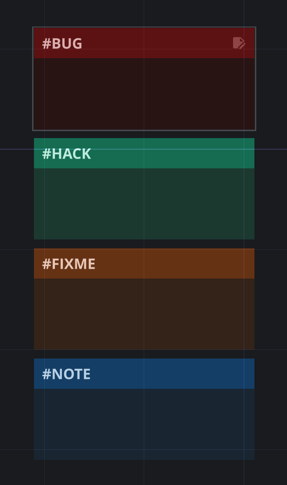

## Short Cuts

### `ctrl+w`
The way you'll use this tox is just as if you were working as you might normally. Only, when you hit `ctrl + w`, if you're inside of a COMP that hasn't been saved externally, you'll be asked if you want to externalize that module. If you select `yes` you'll next be asked where you want to save that module. This module will then create a folder that has the same name as your component, and save the tox inside of that folder (the tox will also have the same name as the component). Better yet, this module will auto-populate the path to the external tox with the location you've selected. When you press `ctrl + w` again it will warn you that you're about to over-write your tox. If you confirm that you want to replace your tox, it will save the updated version right where your previous tox was located. 

### `ctrl+shift+w`
In addition to saving a single file, you can also see all the components that you've changed by using this shortcut. This will open a menu of all of your external COMPs.

## All TOX Components - floating window

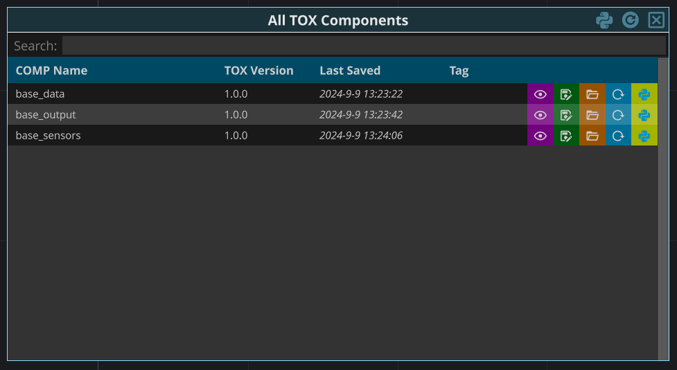

It's not always easy to remember which `COMPs` have been externalized, or to get to them quickly. The `ctrl+shift+w` hot key opens a floating window that can help you manage your external TOX files. This floating window provides a quick view of a number of different attributes for your external files. Here you can see the name, version, and last saved date for your `TOX`. There are also four quick action buttons you might use.

:eye: - jump your current TD network pane to be inside of this component. If you want a fast way to navigate to parts of your TouchDesigner network this can be very helpful.

:floppy_disk: - Save your TOX. You can use this button to save your TOX instead of using `ctrl+w` from inside the Component

:open_file_folder: - open your file explorer to see where this TOX is located on your computer.

:recycle: - reload the TOX in your network. This is equivalent to clicking on the `reload` parameter for your `COMP`

:snake: - re-init your extension. If your TOX has has an extension, you can use this button to quickly reinitialize it without needing to navigate to your component.

# Suggested Workflow

Add the `base_save` `TOX` file into your network. You only need to add one. Save your whole project file (your `.toe`). My recommendation is create a folder for your project somewhere on your computer and to save your `.toe` file in this directory. This will make it easier to collect all of your related files close to your project file. I like keeping my `TOX` files in their own directory. I usually create a folder called something like `td-modules` where I'll save my `TOX` files.

When you're in any COMP in TouchDesigner use the hot-key `ctrl + w`

## Externalization Only
1. Create a directory for your project  
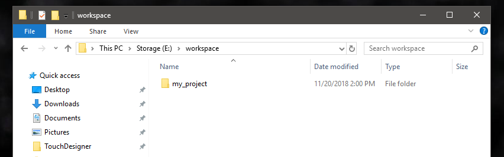

2. Open TouchDesigner and save your `.TOE` file in your new directory **this is an important step** - saving your project makes sure that the member `project.folder` correct points to your `.TOE` file.  

3. Drop the `base_save.tox` from `touchdesigner-save-external\release` into your network - I'd recommend doing this at the root of your project, or in a place in your project specifically designed to hold other tools. I like to create a base called tools where I keep all the things that I use for development, or that any machine might need (meaning when you're thinking on a single `.TOE` file that's configured based on a machine's role)  
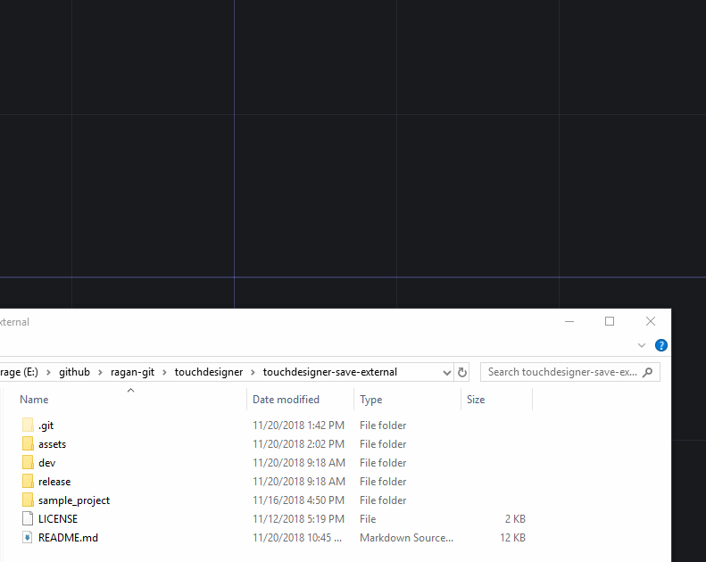

4. Create a new component, and navigate inside of this new COMP.  
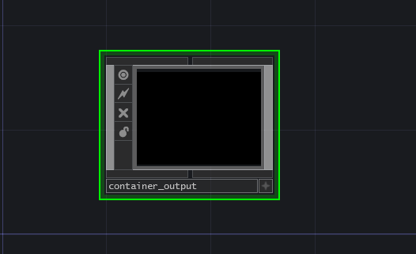

5. Use `ctrl + w` to save your project as you might usually.
6. Notice that you're now prompted to save your COMP externally - select `Yes`  
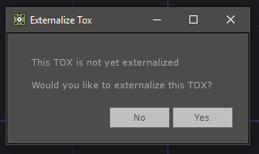

7. Create a new folder in your project folder called `td-modules` (this is my suggestion, though you can use any name you like). Navigate into this folder and compete the save process.  
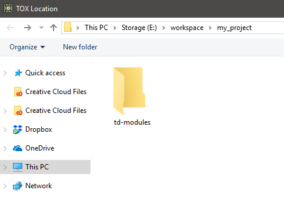

8. Check finder (macOS) or explorer (windows) to see that in `td-moduels` you now have a new directory for your tox, and inside of that directory is your saved tox file.  
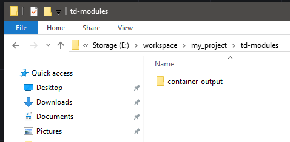  
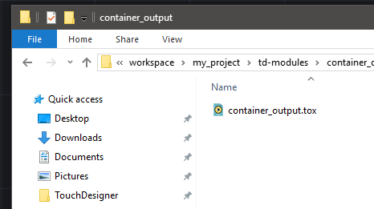 

9. Notice that the color of your tox has changed so you know that it's externalized.  

10. Continue to work and save. Note that when you use `ctrl+w` both your project and your tox are saved. If you happen to create an external `.TOX` inside of a tox that's already externalized, you'll be prompted to save both the `parent()` and the current COMP or just the current COMP.

## Using Git
1. Create a new repo
2. Clone / Initialize your repo locally
3. Open TouchDesigner and save your `.TOE` file in your repo  
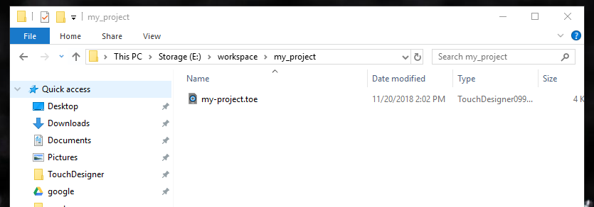

4. Drop the `base_save.tox` from `touchdesigner-save-external\release` into your network - I'd recommend doing this at the root of your project, or in a place in your project specifically designed to hold other tools. I like to create a base called tools where I keep all the things that I use for development, or that any machine might need (meaning when you're thinking on a single `.TOE` file that's configured based on a machine's role)  

5. Create a new component, and navigate inside of this COMP.  

6. Use `ctrl + w` to save your project as you might usually.
7. Notice that you're now prompted to save your COMP externally - select `Yes`  

8. Create a new folder in your project folder called `td-modules` (this is my suggestion, though you can use any name you like). Navigate into this folder and compete the save process.  

9. Check finder (macOS) or explorer (windows) to see that in `td-moduels` you now have a new directory for your tox, and inside of that directory is your saved tox file.  
  
  

10. Notice that the color of your tox has changed so you know that it's externalized.  
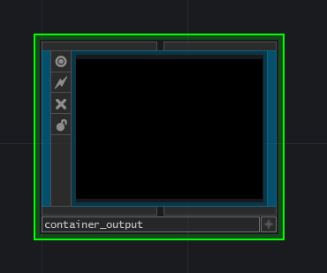

11. Continue to work and save. Note that when you use `ctrl+w` both your project and your tox are saved. If you happen to create an external `.TOX` inside of a tox that's already externalized, you'll be prompted to save both the `parent()` and the current COMP or just the current COMP.
12. Commit and push your work.

# Additional Considerations and Suggestions
At this point, you might have guess that this kind of approach works best in well structured projects. Some suggestions for organization and approach:
* Think about Order and Structure - while I've structured projects lots of different ways, it's worth finding a file structure that you like and sticking with it. That might be a deeply nested structure (watch out that'll bite you if you get too deep - at least on windows), or it might be something more flat. Regardless, think about a structure and stay with it.
* Make Small Simple Tools - to the best of your ability, try to make sure your modules are independent islands. That's not always possible, but if you can think carefully about creating dependencies, you'll be happier for it. Use custom parameters on your components to keep modules independent from one another. Use select operators, or In's and Out's to build connections. 
* Reuse that TOX - while this approach is fancy and fun, especially when working with git, it's also about making your future self happier. Thank carefully about how you might make something re-usable and portable to another project. The more you can think through how to make pieces that can easily move from project to project the more time you can spend on the fun stuff... not on the pieces that are fussy and take lots of time.

# An Example Project
In the folder called `sample_project` open the `Sample_project.toe` to see how this might work. 

# Credits
### Inspired by the work of:  
[Anton Heestand](http://hexagons.se/)  
[Willy Nolan](https://github.com/computersarecool)  
I've had the great fortune of working with both of these find developers. I regularly use an externalization tool authored by these two developers, and this TOX is partially inspired by their work. Many thanks for a tool that keeps on working and makes using GIT with TouchDesigner something that's reasonable.

### Icons
[Material Design Icons by Google](https://material.io/tools/icons/?icon=save_alt&style=baseline)
